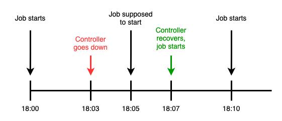

# Scheduling

A JobConfig can be set to automatically create Jobs based on a [cron schedule](https://en.wikipedia.org/wiki/Cron).

## Sample Configuration

```yaml
apiVersion: execution.furiko.io/v1alpha1
kind: JobConfig
spec:
  schedule:
    cron:
      expression: 0 10 * * *
      timezone: America/New_York
    disabled: false
```

## Configuration Options

### `cron`

#### `cron.expression`

Defines a cron expression that defines when the JobConfig should be run.

Furiko uses an [extended cron syntax](./cron-syntax.md) that supports between 5 to 7 tokens, supporting up to second-level granularity of cron expressions. Additionally, Furiko's cron syntax also supports `H` tokens for load balancing.

For more details and examples, see [Cron Syntax](./cron-syntax.md).

#### `cron.timezone`

Defines an optional value that defines the timezone that `cron.expression` should be interpreted in.

For example, a cron schedule of `0 10 * * *` with a timezone of `Asia/Singapore` will be interpreted as running at 02:00:00 UTC every day.

`timezone` must be one of the following values:

1. A valid `tz` string (e.g. `Asia/Singapore`, `America/New_York`) in the [Time Zone Database](https://www.iana.org/time-zones).
2. A UTC offset with minutes (e.g. `UTC-10:00`).
3. A GMT offset with minutes (e.g. `GMT+05:30`). The meaning is the same as its UTC counterpart.

If not specified, defaults to the controller's global default configuration value (via `defaultTimezone`), which defaults to `UTC`.

<!-- prettier-ignore -->
!!! info
    This field merely is used for parsing `cron.expression`, and has nothing to do with `/etc/timezone` inside the container (i.e. it will not set `$TZ` automatically).

### `disabled`

Automatic scheduling can also be disabled or suspended, by specifying `disabled: true`.

## Handling Concurrent Jobs

Jobs may not be scheduled immediately (or forbidden entirely) based on the concurrency policy if there are concurrent executions of Jobs belonging to this JobConfig.

For more details, see [Concurrency](./concurrency.md).

## Once-off Scheduling

A JobConfig can also be scheduled to run once-off in the future by creating a Job with a `startPolicy`.

See [Adhoc Execution](../job/adhoc-execution.md) and [Start Policy](../job/start-policy.md) for more details.

## Back-scheduling

The CronController supports _"back-scheduling"_ Jobs to be created even after its schedule has passed but the controller had detected that it had failed to create one at that point in time.

Given a JobConfig with a `cron.expression` of `*/5 * * * *`, the following diagram illustrates an example of what it looks like:

<figure markdown="1">
  
</figure>

This effectively allows the controller to **survive short periods of downtime** with little repercussions. In practice, most jobs are able to tolerate a few minutes of delay, and it would be more costly to skip the job when it should have been scheduled.

<!-- prettier-ignore -->
!!! tip
    This feature allows the administrator to safely upgrade Furiko at any time, without having to find a time to restart the process that would cause minimal disruption.

### Global Configuration

The back-scheduling thresholds can be further tuned according to you or your organization's requirements.

#### `maxDowntimeThresholdSeconds`

Defines the maximum downtime that the controller can tolerate. If the controller was intentionally shut down for an extended period of time, we should not attempt to back-schedule jobs once it was started.

In practice, setting this to too high of a value means that jobs could be ridiculously delayed when they are better off being skipped entirely (say, sending out a end-of-week report on the following Monday instead).

Defaults to 300 (5 minutes). It is recommended to tune this to the maximum realistic outage duration of the controller.

#### `maxMissedSchedules`

Defines a maximum number of jobs that the controller should back-schedule, or attempt to create after coming back up from downtime. Having a sane value here would prevent a thundering herd of jobs being scheduled that would exhaust resources in the cluster.

In practice, setting this to too high of a value could result in accidental resource exhaustion in the cluster if the controller was intentionally shut down for an extended period of time.

Defaults to 5.
